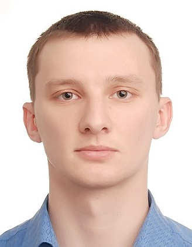

# Ilia Zemskov [@elujaz](https://github.com/elujaz "GitHub")



|   |   |Contacts|   |   |
|:---|---:|:---:|:---|---:|
|[](elujaz.i.a@gmail.com "Email") | [](https://vk.com/ilya_zemskov "VK") |[**Samara**](https://www.google.com/maps/place/Samara,+Samara+Oblast/@53.2605796,49.9179003,10z/data=!3m1!4b1!4m5!3m4!1s0x416618e22bd879d3:0xba95cda9bb3a030b!8m2!3d53.203772!4d50.1606382 "Samara")| [](https://www.instagram.com/eluja.z/ "Instagram")|[](https://t.me/eluja "Telegram")|

# About me

> ## On the way of changing myself.

Main purpuse is to change my current occupation for something more intellegence and interesting with infinity opportunities for education and growth. That's why I started to learn HTML, CSS and JS, when I have become a 30 y.o.

> ## Life position

``` 
For a positive mindset,
Bright thoughts and statements,
Good goals and beliefs
For a positive outlook.
```

> ## Skills

- HTML 
- CSS
- JS
- Git

> ## Code example

```html
<!DOCTYPE HTML>
<html>

<body>

  <script>
    alert( 'Hello, world!' );
  </script>

</body>

</html>
```

> ## Experience

|   |   |   |   |
|---|---|---|---|
|_2014 - Until now_|**Senior attendant**|`airlines`| *Transaero / Aeroflot, Moscow*|
|*2013 - 2014*|**Engineer-technologist**|`factory`| *Metallist, Samara*
|*2012 - 2013*|**Military-service**|`regiment`| *Kremlin, Moscow*|

> ## Education

|University|Department|Specialization|Graduation|
|:---|:---:|:---:|---:|
|[Samara State Aerospace University](https://ssau.ru "Samara University")|*Flying devices*|*Engineer*|*2012*|
|[Stepik](https://stepik.org "Stepik")|*HTML/CSS basic*|*Web dev*|*2021*|

> ## English level

### *Can understand Indians, don't understand Englishman yet*

`Intermediate — A2.` English experience consists of professional english and travel's practices. Pretty enough for coding.